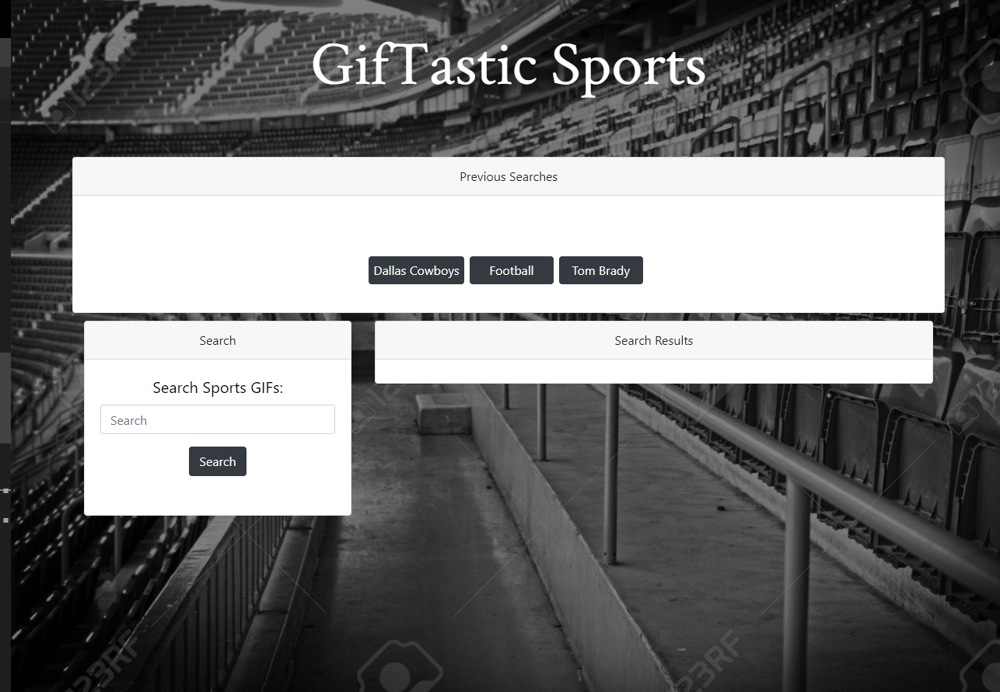

# GifTastic

     

## Table of Contents

* [About the Project](#about-the-project)
* [Built With](#built-with)
* [Usage](#usage)
* [Link to Clean Fridge](#link-to-clean-fridge)

## About The Project

This is a project using the GIPHY API to populate gifs of your choice into the search results and populate latest searches so that you can click and view those gifs again. 

## Built With

* [Bootstrap](https://getbootstrap.com)
* [JQuery](https://jquery.com)
* [GIPHY API](https://developers.giphy.com/?gclid=Cj0KCQiAtf_tBRDtARIsAIbAKe1429lUUMk2ouCJxTyk_OtRTEJVWuTPx6SfpQ8xPDj0-hKni07xUFoaAupfEALw_wcB)

## Usage

The project has 3 pre-made buttons that will display 10 gifs relating to that topic. By entering a desired topic into the search bar will append a new button to the previous search section and create 10 gifs related to the topic you choose. The gifs will be in a still picture, upon clicking on them they will start to animate showing the complete gif and clicking on them will put them back into their still state. 

## Link To Giftastic Sports

Project Link : [https://colemiller21.github.io/GifTastic/](https://colemiller21.github.io/GifTastic/)
